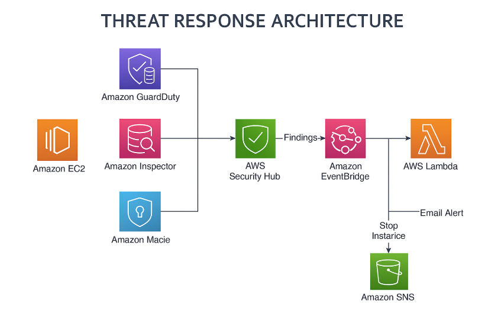

# AWS Threat Detection & Auto-Response Project

This project demonstrates a fully automated cloud threat detection and incident response workflow using AWS native security services. It is designed to run on the AWS Free Tier and automatically reacts to high-severity findings by isolating vulnerable EC2 instances.

---

## 🔍 Overview

**Goal**: Detect threats using GuardDuty, Inspector, Macie, and Config → Aggregate findings via Security Hub → Trigger automatic remediation via Lambda and EventBridge.

---

## 📐 Architecture

---

## 🛠️ Services Used

- **Amazon EC2** – Target instance for monitoring.
- **Amazon GuardDuty** – Threat detection (e.g. port scanning, credential misuse).
- **Amazon Inspector** – Vulnerability assessment.
- **Amazon Macie** – Sensitive data discovery in S3.
- **AWS Config** – Compliance rule monitoring.
- **AWS Security Hub** – Central aggregation of findings.
- **AWS Lambda** – Automates EC2 remediation.
- **Amazon SNS** – Sends notification emails.
- **Amazon EventBridge** – Routes Security Hub findings to Lambda.

---

## 🚀 Setup Process

1. **Launch EC2 Instance**  
   Amazon Linux 2, `t2.micro`, SSH enabled.

2. **Enable Security Services**  
   - GuardDuty  
   - Inspector  
   - Macie  
   - AWS Config  
   - Security Hub (integrated with all above)

3. **Create Notification Channel**  
   - SNS Topic + email subscription.

4. **Remediation Automation**  
   - Lambda to stop EC2.
   - EventBridge rule for HIGH/CRITICAL findings.

---

## 🎯 Threat Simulations

- **GuardDuty**: Opened SSH to `0.0.0.0/0`
- **Inspector**: Left unpatched EC2; installed vulnerable packages
- **Macie**: Uploaded mock sensitive CSV data (emails, SSNs) to S3

---

## ✅ Outputs

| Tool        | Example Finding                                  |
|-------------|--------------------------------------------------|
| GuardDuty   | Root user API call without MFA                   |
| Inspector   | Vulnerable Apache HTTP Server package            |
| Macie       | Sensitive data found in public S3 object         |
| Security Hub| Aggregated CRITICAL alerts triggering Lambda     |

---

## 📸 Screenshots

- [x] GuardDuty Dashboard
- [x] Inspector Findings
- [x] Macie Sensitive Data Result
- [x] Security Hub Alerts
- [x] EventBridge Rule
- [x] SNS Email 

_See `/screenshots` folder for all visuals._

---

## 🧪 Testing the Flow

- ✅ Vulnerability detected
- ✅ Alert routed to Security Hub
- ✅ EventBridge triggered Lambda
- ✅ Lambda shut down EC2 instance
- ✅ Email notification sent (optional)

---

## 📄 Project Report

See [`project-report.md`](project-report.md) for full problem statement, design decisions, implementation steps, and final observations.

---

## 📌 Notes

- This project was built on AWS Free Tier services (except Macie after trial).
- Sensitive data was **mock only** — no real PII used.
